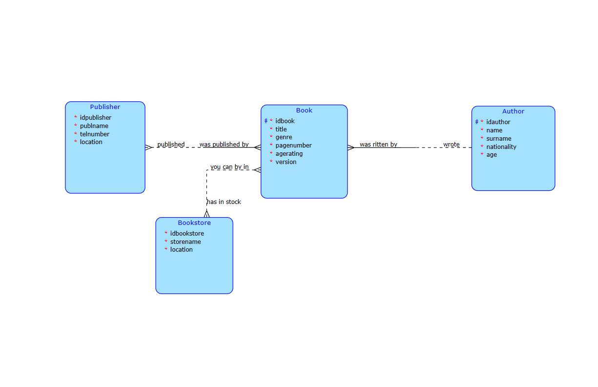

# PROJECT (SERVER PART).

##### *Archive-type website for books (following the information of where you can buy them or who is the publisher etc.).*

### Relations and objects model

### Business operations

##### *Adding new author.*
This operation will allow user to add new author to the archive with the existing information (name, surname, nationality). At first client will make sure, that the author with the same data does not already exist on the server. If not, client will send the request to add the new author.

### Complex request in JPQL

List all books, that were published by a certain company AND are in-stock in a specific bookstore.

